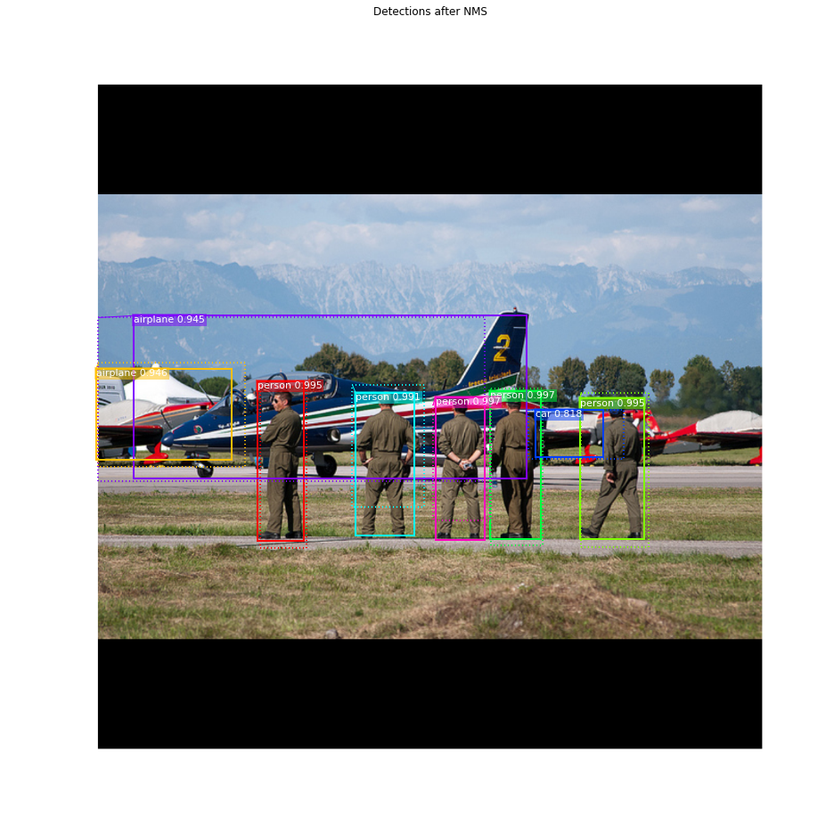

# Deep-Learning-Models
 Desnet, VGG, Capsule Network, Resnet, ALEXNET, MobileNet, Nansnet, Federated Learning-Models, RCNN, GAN
 
 
## Overview GAN  (GAN)
  
  <h1> List of Models </h1>
    + [Auxiliary Classifier GAN](#ac-gan)
    + [Adversarial Autoencoder](#adversarial-autoencoder)
    + [Bidirectional GAN](#bigan)
    + [Boundary-Seeking GAN](#bgan)
    + [Conditional GAN](#cgan)
    + [Context-Conditional GAN](#cc-gan)
    + [Context Encoder](#context-encoder)
    + [Coupled GANs](#cogan)
    + [CycleGAN](#cyclegan)
    + [Deep Convolutional GAN](#dcgan)
    + [DiscoGAN](#discogan)
    + [DualGAN](#dualgan)
    + [Generative Adversarial Network](#gan)
    + [InfoGAN](#infogan)
    + [LSGAN](#lsgan)
    + [Pix2Pix](#pix2pix)
    + [PixelDA](#pixelda)
    + [Semi-Supervised GAN](#sgan)
    + [Super-Resolution GAN](#srgan)
    + [Wasserstein GAN](#wgan)
    + [Wasserstein GAN GP](#wgan-gp)     
	
	
	<h1>Implementations    </h1>

    

<h1> DiscoGAN </h1>

    

    

<h1> DualGAN </h1>

<h1> GAN </h1>

    

<h1> InfoGAN </h1>

    

<h1> LSGAN </h1>
Implementation of _Least Squares Generative Adversarial Networks_.

<h1> Pix2Pix </h1>

    

    

<h1> PixelDA </h1>

#### MNIST to MNIST-M Classification
Trains a classifier on MNIST images that are translated to resemble MNIST-M (by performing unsupervised image-to-image domain adaptation). This model is compared to the naive solution of training a classifier on MNIST and evaluating it on MNIST-M. The naive model manages a 55% classification accuracy on MNIST-M while the one trained during domain adaptation gets a 95% classification accuracy.

| Method       | Accuracy  |
| ------------ |:---------:|
| Naive        | 55%       |
| PixelDA      | 95%       |

<h1> SGAN </h1>

    

<h1> SRGAN </h1>

    

    

<h1> WGAN </h1>

    

<h1> WGAN GP</h1>

    

 
 ## Overview R-CNN Medical Images (3D-medical-images-detection)
This is a comprehensive framework for object detection featuring:
- 2D + 3D implementations of prevalent object detectors: e.g. Mask R-CNN [1], Retina Net [2], Retina U-Net [3]. 
- Modular and light-weight structure ensuring sharing of all processing steps (incl. backbone architecture) for comparability of models.
- training with bounding box and/or pixel-wise annotations.
- dynamic patching and tiling of 2D + 3D images (for training and inference).
- weighted consolidation of box predictions across patch-overlaps, ensembles, and dimensions [3].
- monitoring + evaluation simultaneously on object and patient level. 
- 2D + 3D output visualizations.
- integration of COCO mean average precision metric [5]. 
- integration of MIC-DKFZ batch generators for extensive data augmentation [6].
- easy modification to evaluation of instance segmentation and/or semantic segmentation.
 
[1] He, Kaiming, et al.  <a href="https://arxiv.org/abs/1703.06870">"Mask R-CNN"</a> ICCV, 2017 
[2] Lin, Tsung-Yi, et al.  <a href="https://arxiv.org/abs/1708.02002">"Focal Loss for Dense Object Detection"</a> TPAMI, 2018. 
[3] Jaeger, Paul et al. <a href="http://arxiv.org/abs/1811.08661"> "Retina U-Net: Embarrassingly Simple Exploitation
of Segmentation Supervision for Medical Object Detection" </a>, 2018

[5] https://github.com/cocodataset/cocoapi/blob/master/PythonAPI/pycocotools/cocoeval.py 
[6] https://github.com/MIC-DKFZ/batchgenerators  

<h1>  Framework </h1>

This framework features all models explored in [3] (implemented in 2D + 3D): The proposed Retina U-Net, a simple but effective Architecture fusing state-of-the-art semantic segmentation with object detection,  

 
also implementations of prevalent object detectors, such as Mask R-CNN, Faster R-CNN+ (Faster R-CNN w\ RoIAlign), Retina Net, U-Faster R-CNN+ (the two stage counterpart of Retina U-Net: Faster R-CNN with auxiliary semantic segmentation), DetU-Net (a U-Net like segmentation architecture with heuristics for object detection.)   

 

<h1>Results </h1>
By default, loss functions and performance metrics are monitored:   
 

Histograms of matched output predictions for training/validation/testing are plotted per foreground class:   

Input images + ground truth annotations + output predictions of a sampled validation abtch are plotted after each epoch (here 2D sampled slice with +-3 neighbouring context slices in channels):   

Zoomed into the last two lines of the plot:   

 # Mask R-CNN for Object Detection and Segmentation (RCNN)

The repository includes:
* Source code of Mask R-CNN built on FPN and ResNet101.
* Training code for MS COCO
* Pre-trained weights for MS COCO
* Jupyter notebooks to visualize the detection pipeline at every step
* ParallelModel class for multi-GPU training
* Evaluation on MS COCO metrics (AP)
* Example of training on your own dataset

<H1> Step by Step Detection </h1>
To help with debugging and understanding the model, there are 3 notebooks 
([inspect_data.ipynb](samples/coco/inspect_data.ipynb), [inspect_model.ipynb](samples/coco/inspect_model.ipynb),
[inspect_weights.ipynb](samples/coco/inspect_weights.ipynb)) that provide a lot of visualizations and allow running the model step by step to inspect the output at each point. Here are a few examples:

<H2> 1. Anchor sorting and filtering</H2>
Visualizes every step of the first stage Region Proposal Network and displays positive and negative anchors along with anchor box refinement.

<H2> 2. Bounding Box Refinement </H2>
This is an example of final detection boxes (dotted lines) and the refinement applied to them (solid lines) in the second stage.

<H2> 3. Mask Generation </H2>
Examples of generated masks. These then get scaled and placed on the image in the right location.

<H2> 4.Layer activations </H2>
Often it's useful to inspect the activations at different layers to look for signs of trouble (all zeros or random noise).

<H2> 5. Weight Histograms </H2>
Another useful debugging tool is to inspect the weight histograms. These are included in the inspect_weights.ipynb notebook.

<H2> 6. Logging to TensorBoard </H2>
TensorBoard is another great debugging and visualization tool. The model is configured to log losses and save weights at the end of every epoch.

<H2> 6. Composing the different pieces into a final result </H2>

 

